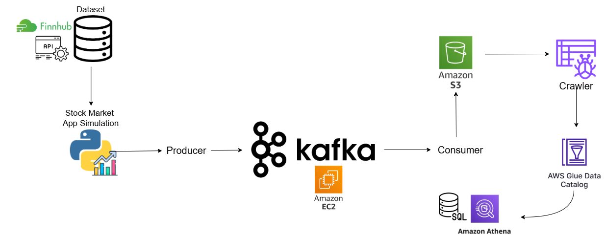

# 📈 Real-Time Stock Market Data Pipeline (AWS + Kafka)

## Overview
This repository contains the source code for an end-to-end real-time data engineering pipeline. The system ingests live stock market data (AAPL, AMZN, TSLA) using the **Finnhub WebSocket API**, processes it in real-time through **Apache Kafka** hosted on **AWS EC2**, and stores it in an **Amazon S3 Data Lake** for serverless analytics using **AWS Athena**.

**Read the full Technical Documentation:**
For a deep dive into the architecture, cloud infrastructure setup and step-by-step implementation, read my article on Medium:
**[Read the Full Documentation on Medium](https://medium.com/@danalacheemanuel/real-time-stock-market-data-processing-pipeline-using-aws-and-apache-kafka-88716364dcf4)**

## Technology Stack
*   **Data Ingestion:** Python, Finnhub WebSocket API
*   **Message Broker:** Apache Kafka, Zookeeper
*   **Cloud Infrastructure (AWS):** EC2 (Ubuntu 24.04), S3, Glue Crawler, Athena
